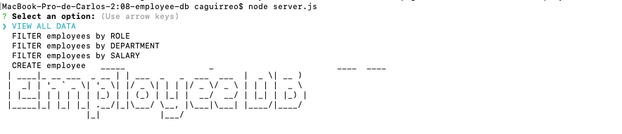

# WORK DATA
###### Developed by [*ca2los*](https://github.com/ca2los)
###### STILL IN PROGRESS
VERSION 1.0

### *Employee Generator*
The purpose of this project is to create an employee database from the command line. It 
must allow you to create, update, read and delete data through different tables.

### *IMPORTANT*
The project is still in development. At the moment the queries are working only through
the MySQL shell, but not from the server file. 

### Installation
To run the program, you must make sure **Node JS** and **NPM** are already
installed in your computer.

#### *Node JS*
To check if **Node JS** is already installed, from your `Terminal Console` enter the
command `node -v` and press the **ENTER** key. It will show you a message with the
version of Node only if the package was installed before. If the message is different,
[click the link](https://nodejs.org/en/) and download the recommended version of the
package and install it.

#### *NPM*
To check if **NPM** is already installed, from your `Terminal Console` enter the
command `npm -v` and press the **ENTER** key. It will show you a message with the
version of Node only if the package was installed before. If the message is different,
then enter the command `npm install`and press the **ENTER** key.

### How to use it
From your terminal console, go through your files and locate the folder you want
to work with. Now enter the command `npm init -y` and press the **ENTER** key. Now
do the same with the command `npm i inquirer --save` and press the **ENTER** key.

Once the packages are installed, from your terminal console and in the same folder
run the command `node index.js`and press ENTER. Finally, when the program starts you
will need to access the requested data and press ENTER every time you finish.

### GET ALL DATA
```javascript
    function get_all(){
        return this.connection.promise().query (
            "SELECT employee.first_name, employee.last_name, role.title AS role, role.salary FROM employee LEFT JOIN role ON employee.id = role.id ORDER BY employee.first_name;"
        );
    }
```
### GET ALL DATA: BY ROLE
```javascript
    function get_role(){
        return this.connection.promise().query (
            "SELECT employee.first_name, role.title FROM employee LEFT JOIN role ON employee.id = role.id ORDER BY employee.first_name;"
        );
    }
```
### GET ALL DATA: BY DEPARTMENT
```javascript
function get_department(){
    return this.connection.promise().query (
        "SELECT employee.first_name, department.name FROM employee LEFT JOIN department ON employee.id = department.id ORDER BY employee.first_name;"
    );
}
```
### GET ALL DATA: BY SALARY
```javascript
function get_salary(){
    return this.connection.promise().query (
        "SELECT employee.first_name, employee.last_name, role.salary FROM employee LEFT JOIN role ON employee.id = role.id ORDER BY employee.first_name;"
    );
}
```
### CREATE NEW: EMPLOYEE
```javascript
function post_employee(){
    return this.connection.promise().query (
        "INSERT INTO employee (first_name,last_name,role_id,manager_id) VALUES (?,?,?,?);"
    );
}
```

#### This is how you will see the program running from your CLI:


### Testing
The project is still in progress, this is not the final version.

### MIT License
###### Developed by [*ca2los*](https://github.com/ca2los)